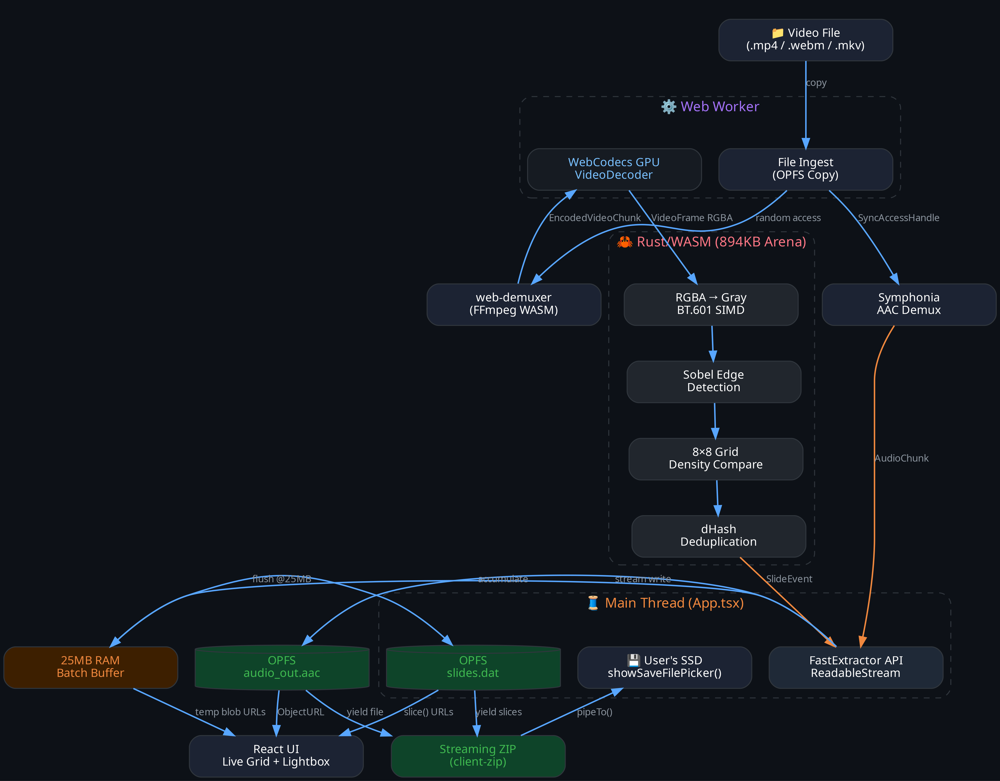
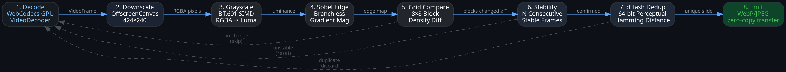
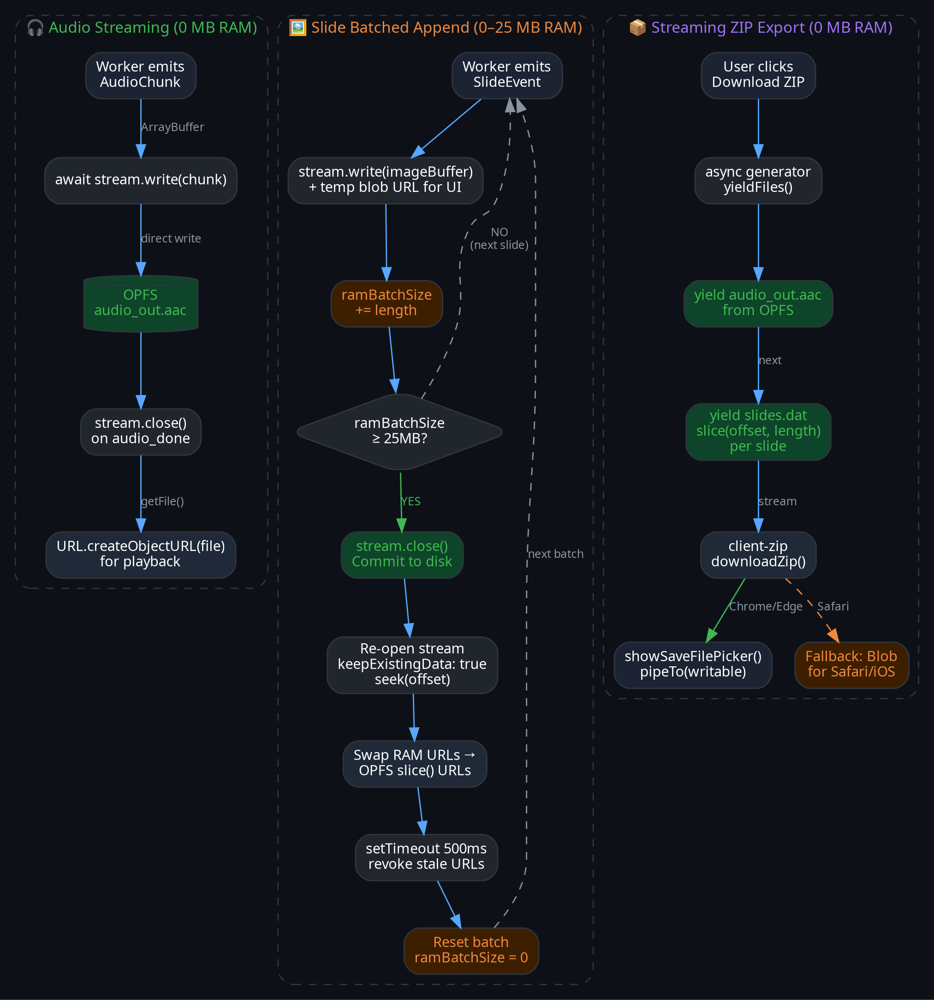

# ⚡ FastExtractor

**Browser-native video slide & audio extraction engine.**

Extract presentation slides and audio from video files entirely in the browser — no server, no uploads, no FFmpeg CLI. Powered by WebCodecs, WebAssembly, and OPFS.

> **[Live Demo →](https://fast-extractor.mm541.in)**

---

## ✨ Features

- **🖼️ Slide extraction** — unique slides captured as WebP/JPEG with millisecond-accurate timestamps
- **🎧 Audio extraction** — raw AAC stream, ready to play or transcribe
- **🚀 Turbo mode** — keyframe-only scanning, processes a 1-hour HD video in under 15 seconds
- **🎯 Sequential mode** — sequential full-frame decode for pixel-perfect transitions
- **🎭 Region masking** — interactive 8×8 grid to exclude webcam overlays, watermarks, etc.
- **📊 Live metrics** — real-time decode speed, frame count, peak RAM, and analysis time
- **🔒 100% client-side** — your video never leaves the browser
- **📱 Mobile-safe** — adaptive memory management, Android SAF handling, backpressure controls

### 🎨 Reference Demo UI
The included React demo (`App.tsx`) showcases how to consume the library's streams efficiently:
- **💾 Zero-RAM OPFS streaming** — audio chunks and slides stream directly to disk via Origin Private File System
- **📦 Streaming ZIP export** — `client-zip` pipes assets directly to the user's SSD via `showSaveFilePicker()`, with a Blob fallback for Safari
- **🧱 25MB Batched Slide Packing** — slides are packed into a single `slides.dat` file with byte-addressable offsets; RAM usage is hard-capped at 25MB regardless of video length

---

## ⚡ Performance & Benchmarks

*All benchmarks represent the **full extraction pipeline** (concurrent Audio AAC stream demuxing + unique Slide WebP exportation).*

| Device / Hardware | OS / Browser | Resolution | Mode | Video Length | Processing Time | Speed |
|-------------------|--------------|------------|------|--------------|-----------------|-------|
| **ASUS TUF F17** (i9-12900H, 16GB, RTX 3050 Ti) | Linux (Chrome 142) | **720p HD** | Turbo | 3h 43m | **35s** | **382×** |
| **ASUS TUF F17** (i9-12900H, 16GB, RTX 3050 Ti) | Linux (Chrome 142) | **720p HD** | Sequential | 3h 43m | **6m 50s** | **33×** |
| **ASUS TUF F17** (i9-12900H, 16GB, RTX 3050 Ti) | Linux (Chrome 142) | **1080p FHD** | Turbo | 5h 53m | **1m 20s** | **265×** |
| **ASUS TUF F17** (i9-12900H, 16GB, RTX 3050 Ti) | Linux (Chrome 142) | **1080p FHD** | Sequential | 5h 53m | **22m 2s** | **16×** |
| **Redmi Note 9 Pro** (SD 720G, 4GB) | Android (Chrome 146) | **1080p FHD** | Turbo | 5h 53m | **7m 30s** | **47×** |
| **Redmi Note 9 Pro** (SD 720G, 4GB) | Android (Chrome 146) | **1080p FHD** | Sequential | 5h 53m | **50m** | **7×** |
| **AMD A6-7310** (2015 Legacy APU, 4GB) | Linux (Firefox 149) | **1080p FHD** | Turbo | 5h 53m | **10m 50s** | **32×** |

*Note: The AMD A6 benchmark demonstrates worst-case "floor" performance, successfully extracting a 6-hour video on a decade-old processor with slow DDR3 memory, proving the engine's extreme memory efficiency.*

---

## How It Works



**Key architecture decisions:**
- **Zero GC pressure** — 894KB preallocated static WASM memory arena, no per-frame allocations
- **Hardware decode** — WebCodecs uses the GPU, not software decoders
- **Zero-copy transfers** — `ArrayBuffer` transferred (not cloned) from Worker to main thread
- **LLVM-optimized** — bounds-check-free loops, branchless edge detection, SIMD auto-vectorization
- **Zero-RAM UI pipeline (Demo)** — audio streams to OPFS, slides batch-flush to a single `.dat` file every 25MB, ZIP exports stream directly to disk

---

## Quick Start

```typescript
import { FastExtractor } from './fast-extractor';

// 1. Check browser support
const support = await FastExtractor.checkBrowserSupport();
if (!support.supported) {
  console.error(support.reason);
}

// 2. Create extractor (defaults to turbo mode)
const extractor = new FastExtractor({ mode: 'turbo' });

// 3. Extract from a File object (e.g. from <input type="file">)
const stream = extractor.extract(file);
const reader = stream.getReader();

while (true) {
  const { done, value: event } = await reader.read();
  if (done) break;

  switch (event.type) {
    case 'audio':
      // Raw AAC chunk (ArrayBuffer).
      // Recommended: stream directly to OPFS instead of accumulating in RAM.
      await opfsAudioStream.write(event.chunk);
      break;

    case 'audio_done':
      // All audio extracted. event.fileName = suggested filename.
      await opfsAudioStream.close();
      break;

    case 'slide':
      // New slide detected.
      // event.imageBuffer = WebP/JPEG ArrayBuffer
      // event.timestamp   = "01:23:45"
      // event.startMs     = 83000
      // event.endMs       = 128000
      // Recommended: append to an OPFS slides.dat file with byte offsets.
      break;

    case 'progress':
      // event.percent = 0-100, event.message = status text
      // event.metrics = { totalFrames, totalSlides, peakRamMb, ... }
      break;

    case 'error':
      // Recoverable error (e.g. Android file permission expired)
      if (event.recoverable) {
        // Re-open file picker and retry
      }
      break;
  }
}
```

### Error Handling

All fatal errors are instances of `ExtractorError` with a typed `code` property. No string parsing required.

```typescript
import { FastExtractor, ExtractorError } from './fast-extractor';

try {
  for await (const event of extractor.extract(file)) {
    // ... handle events
  }
} catch (err) {
  if (err instanceof ExtractorError) {
    switch (err.code) {
      case 'ERR_OPFS_NOT_SUPPORTED':
        showMessage('Your browser does not support OPFS. Try Chrome 102+.');
        break;
      case 'ERR_OPFS_STALE_LOCK':
        showMessage('A previous session is still active. Refresh the page.');
        break;
      case 'ERR_AUDIO_EXTRACTION':
        showMessage('No AAC audio track found. Try an MP4 file.');
        break;
      case 'ERR_VIDEO_DECODE':
        showMessage('Video format not supported by this browser.');
        break;
      default:
        showMessage(`Extraction failed: ${err.message}`);
    }
  }
}
```

### Callback API

Prefer callbacks over streams? Use `extractWithCallbacks()` — same engine, simpler wiring:

```typescript
const extractor = new FastExtractor({ mode: 'turbo' });

await extractor.extractWithCallbacks(file, {
  onSlide: (slide) => {
    const img = document.createElement('img');
    img.src = URL.createObjectURL(new Blob([slide.imageBuffer], { type: 'image/webp' }));
    document.body.appendChild(img);
  },
  onAudio: (chunk) => audioChunks.push(chunk),
  onProgress: (pct, msg) => console.log(`${pct}%: ${msg}`),
  onError: (err) => console.error(err.code, err.message),
  onDone: () => console.log('Extraction complete!'),
});
```

### React Hook

For React apps, `useFastExtractor` manages all state automatically:

```tsx
import { useFastExtractor } from './ui/useFastExtractor';

function App() {
  const {
    extract, cancel,
    isExtracting, progress, slides, audioBlob, error
  } = useFastExtractor({ mode: 'turbo' });

  return (
    <div>
      <input
        type="file"
        accept="video/*"
        onChange={(e) => extract(e.target.files![0])}
        disabled={isExtracting}
      />

      {isExtracting && (
        <p>{progress.message} — {progress.percent}%</p>
      )}

      {error && <p style={{ color: 'red' }}>{error.message}</p>}

      {slides.map((s, i) => (
        
      ))}

      {audioBlob && (
        <audio controls src={URL.createObjectURL(audioBlob)} />
      )}

      {isExtracting && <button onClick={cancel}>Cancel</button>}
    </div>
  );
}
```

The hook returns:

| Field | Type | Description |
|-------|------|-------------|
| `extract(file)` | `(File) => void` | Start extraction (auto-cancels previous) |
| `cancel()` | `() => void` | Cancel current extraction |
| `isExtracting` | `boolean` | Whether extraction is in progress |
| `progress` | `{ percent, message }` | Current progress state |
| `slides` | `SlideResult[]` | Accumulated slides with `url`, `timestamp`, `startMs`, `endMs` |
| `audioBlob` | `Blob \| null` | Finalized AAC audio blob |
| `error` | `Error \| null` | Last error (includes `ExtractorError` with `.code`) |
| `metrics` | `object \| null` | Final performance metrics |

### Cancellation

```typescript
const controller = new AbortController();
const stream = extractor.extract(file, controller.signal);

// Cancel anytime:
controller.abort();
```

### Debug Mode

Pass `debug: true` to log every internal worker message to the browser console:

```typescript
const extractor = new FastExtractor({ mode: 'turbo', debug: true });
```

```
[FastExtractor:DEBUG] Worker → Main | type=STATUS {status: "Worker Thread Initializing...", ...}
[FastExtractor:DEBUG] Worker → Main | type=INIT_COMPLETE {}
[FastExtractor:DEBUG] Worker → Main | type=AUDIO_CHUNK {buffer: ArrayBuffer(4096)}
...
```

No performance impact when `debug: false` (the default) — the logging branch is never entered.

---

## Extraction Modes

| Mode | Strategy | Speed | Accuracy | Default |
|------|----------|-------|----------|---------|
| `'turbo'` | Keyframe-only seeking | ~20s / 1hr video | ~95% of transitions | ✅ Yes |
| `'sequential'` | Sequential frame decode | ~2-3min / 1hr video | 100% of transitions | |

```typescript
// Turbo (default) — 10x faster, skips non-keyframes
new FastExtractor({ mode: 'turbo' });

// Sequential — every frame, catches subtle transitions
new FastExtractor({ mode: 'sequential' });
```


---

## Configuration

All options have sensible defaults. Most users won't need to change anything.

> **🎯 Tuning Tip:** Don't guess parameter values from docs — use the **[live demo](https://fast-extractor.mm541.in)** as a calibration workbench. Drop in a sample video representative of your use case, adjust `edgeThreshold`, `blockThreshold`, `confirmThreshold`, and the region mask interactively, see exactly which slides get captured in real-time, then copy the tuned values into your code.

```typescript
new FastExtractor({
  mode: 'turbo',
  extractAudio: true,
  extractSlides: true,
  sampleFps: 1,
  edgeThreshold: 30,
  blockThreshold: 12,
  minSlideDuration: 3,
  densityThresholdPct: 5,
  dhashDuplicateThreshold: 10,
  confirmThreshold: 10,
  imageQuality: 0.8,
  exportResolution: 0,
  ignoreMask: 0n,
  cleanupAfterExtraction: true,
});
```

### Parameter Reference

#### `mode`
**Type:** `'turbo' | 'sequential'` · **Default:** `'turbo'`

Controls which video decoding strategy is used.

- **`'turbo'`** — Decodes only keyframes (IDR frames). The decoder is flushed between each keyframe, resulting in ~10x speed. Catches ~95% of slide transitions. Uses software decoding (`prefer-software`) to avoid GPU pipeline stall issues with isolated keyframes on mobile GPUs.
- **`'sequential'`** — Decodes every frame sequentially in 300-second chunks. Catches 100% of transitions including gradual scrolls and animations. Uses hardware decoding (GPU) since it feeds a continuous frame stream.

| Scenario | Recommended |
|----------|-------------|
| Lecture recordings (1+ hours) | `'turbo'` |
| Short screen recordings (<10 min) | `'sequential'` |
| Mobile devices with ≤4GB RAM | `'turbo'` |
| Animated/scrolling slide transitions | `'sequential'` |

---

#### `sampleFps`
**Type:** `number` · **Range:** `0.2–10` · **Default:** `1`

**Sequential mode only.** Frame sampling rate for sequential mode. 
- **`1`** — Compare 1 frame per second (default).
- **`0.5`** — Extract and compare 1 frame every 2 seconds. Faster, but may drift timestamp precision slightly.
- **`5`** — Analyze 5 frames a second. Catches extremely fast transitions but will heavily load the CPU.

*Ignored in `turbo` mode, which natively decodes exactly one keyframe every few seconds depending on the file's encoding.*

---

#### `edgeThreshold`
**Type:** `number` · **Range:** `10–100` · **Default:** `30`

Controls how aggressive the Sobel edge detector is. The WASM engine computes horizontal + vertical gradients for every pixel. If the gradient magnitude exceeds this threshold, the pixel is flagged as an "edge pixel."

- **Lower values (10–20):** More edges detected. Sensitive to subtle text changes, thin lines, and small UI elements. Can cause false positives from compression artifacts or video noise.
- **Higher values (50–100):** Only bold edges (large text, thick borders, high-contrast shapes) are detected. Useful for noisy webcam recordings where compression introduces phantom edges.

| Scenario | Recommended |
|----------|-------------|
| Clean screen recordings (OBS, Loom) | `25–35` |
| Webcam-heavy recordings with compression | `40–60` |
| Whiteboard / handwriting videos | `15–25` |

---

#### `blockThreshold`
**Type:** `number` · **Range:** `1–64` · **Default:** `12`

The frame is divided into an 8×8 grid (64 blocks). After edge detection, each block's edge density is compared against the baseline slide. This parameter sets how many blocks must change before a new slide is triggered.

- **Lower values (3–8):** Triggers on small regional changes — a single paragraph updating, a chat bubble appearing, a code diff highlighting.
- **Higher values (20–40):** Only triggers when a large portion of the screen changes — full slide transitions, page navigations, app switches.

| Scenario | Recommended |
|----------|-------------|
| PowerPoint / Google Slides | `10–15` |
| IDE / code walkthroughs | `5–10` |
| Full-screen app demos | `15–25` |

---

#### `minSlideDuration`
**Type:** `number` (seconds) · **Range:** `1–30` · **Default:** `3`

Minimum time (in seconds) that must elapse between two slide captures. Prevents rapid-fire captures during animated transitions, loading spinners, or quick page flips.

- **Lower values (1–2):** Captures fast-paced content where slides change every few seconds.
- **Higher values (10–30):** Only captures slides that stay on screen for a long time. Good for hour-long lectures where the speaker lingers on each slide.

| Scenario | Recommended |
|----------|-------------|
| Fast-paced product demos | `1–2` |
| University lectures | `3–5` |
| Conference keynotes (slow transitions) | `5–10` |

---

#### `densityThresholdPct`
**Type:** `number` (percent) · **Range:** `1–50` · **Default:** `5`

Within each 8×8 grid block, this is the minimum percentage of edge pixels that must differ between frames for that block to count as "changed." This prevents noise and compression artifacts from triggering false block changes.

- **Lower values (1–3):** Extremely sensitive. Catches minute text edits but may false-trigger on video compression noise.
- **Higher values (10–30):** Only counts a block as changed if a significant portion of its edge structure shifted. Robust to noise but may miss small edits.

| Scenario | Recommended |
|----------|-------------|
| High-quality screen recordings (1080p+) | `3–5` |
| Heavily compressed videos (low bitrate) | `8–15` |
| 4K recordings | `3–5` |

---

#### `dhashDuplicateThreshold`
**Type:** `number` · **Range:** `0–20` · **Default:** `10`

After a slide is captured, its 64-bit perceptual hash (dHash) is compared against all previously captured slides. If the Hamming distance is below this threshold, the slide is considered a duplicate and discarded.

- **`0`:** Disable deduplication entirely (every triggered slide is kept).
- **Lower values (3–6):** Only exact or near-exact duplicates are suppressed. Different slides with similar layouts will both be kept.
- **Higher values (12–18):** Aggressively merges slides that look structurally similar, even if text content differs. Useful when the video revisits the same slide multiple times.

| Scenario | Recommended |
|----------|-------------|
| Lectures that revisit previous slides | `10–15` |
| Each slide has unique dense content | `5–8` |
| Disable dedup (keep everything) | `0` |

---

#### `confirmThreshold`
**Type:** `number` · **Range:** `3–20` · **Default:** `10`

**Turbo mode only.** After a keyframe triggers a potential slide change, the engine requires this many subsequent keyframes to remain "stable" (i.e., not trigger another change) before the slide is confirmed and emitted. This filters out brief flickers, transitions, and loading screens.

- **Lower values (3–5):** Faster confirmation. Slides are emitted almost immediately after detection. May capture mid-transition frames.
- **Higher values (12–20):** Requires the slide to persist across many keyframes. Very conservative — only emits slides that the speaker stayed on for a while.

| Scenario | Recommended |
|----------|-------------|
| Videos with frequent transitions | `8–12` |
| Stable lecture recordings | `5–8` |
| Extremely noisy/flickery videos | `15–20` |

---

#### `imageQuality`
**Type:** `number` · **Range:** `0.01–1.0` · **Default:** `0.8`

WebP compression quality for exported slide images. Higher values produce larger, sharper images.

- **`0.5–0.7`:** Good for thumbnails or when storage is limited. Visible compression artifacts on text.
- **`0.8–0.9`:** Balanced — sharp text, reasonable file sizes (~50-150KB per slide at 1080p).
- **`0.95–1.0`:** Near-lossless. Large files but pixel-perfect text reproduction.

---

#### `exportResolution`
**Type:** `number` · **Default:** `0`

Maximum width (in pixels) for exported slide images. The aspect ratio is preserved. Set to `0` to export at the video's native resolution.

- **`0`:** Native resolution (e.g., 1920px for a 1080p video).
- **`1280`:** Cap at 720p-equivalent width. Good for mobile-optimized output.
- **`3840`:** Allow full 4K export.

---

#### `ignoreMask`
**Type:** `bigint` · **Default:** `0n`

A 64-bit bitmask controlling which of the 8×8 grid blocks are excluded from slide detection. Bit `(row * 8 + col)` = `1` means that block is ignored. Use the built-in `GridMaskPicker` UI component to visually generate this value.

Common use cases: masking a webcam overlay in the corner, ignoring a persistent chat sidebar, excluding a video player's control bar.

---

#### `extractAudio` / `extractSlides`
**Type:** `boolean` · **Default:** `true` / `true`

Toggle audio or slide extraction independently. Set `extractAudio: false` if you only need slides (saves processing time). Set `extractSlides: false` if you only need the audio track.

---

#### `cleanupAfterExtraction`
**Type:** `boolean` · **Default:** `true`

Whether to delete OPFS temporary files after extraction completes. Set to `false` if you plan to re-process the same video multiple times (avoids re-ingestion). Call `FastExtractor.cleanupStorage()` manually when done.

---

#### Advanced: `wasmUrl`, `demuxerWasmUrl`, `worker`

For non-Vite bundlers (Webpack, Rollup, etc.) that don't support `?url` and `?worker` imports, you can manually provide:

- **`wasmUrl`** — Absolute URL to the `wasm_extractor_bg.wasm` binary.
- **`demuxerWasmUrl`** — Absolute URL to the `web-demuxer` WASM binary.
- **`worker`** — A pre-instantiated `Worker` pointing to your bundled worker script.

---

## Static Methods

### `FastExtractor.checkBrowserSupport()`

Check if the current browser has the required APIs.

```typescript
const support = await FastExtractor.checkBrowserSupport();
// support.webCodecs       — VideoDecoder available
// support.opfs            — OPFS sync access available
// support.offscreenCanvas — OffscreenCanvas in workers
// support.deviceMemoryGb  — RAM (if exposed)
// support.isMobile        — Mobile browser detected
// support.supported       — Can run extraction?
// support.reason          — Why not (if unsupported)
```

### `FastExtractor.cleanupStorage()`

Manually delete OPFS temp files. Only needed when `cleanupAfterExtraction: false`.

```typescript
await FastExtractor.cleanupStorage();
```

---

## Stream Events

| Event | Fields | When |
|-------|--------|------|
| `audio` | `chunk: ArrayBuffer` | Each audio chunk (streamed) |
| `audio_done` | `fileName: string` | Audio extraction complete |
| `slide` | `imageBuffer`, `timestamp`, `startMs`, `endMs` | New slide detected |
| `progress` | `percent`, `message`, `metrics?` | Status updates |
| `error` | `message`, `recoverable` | Non-fatal error (stream stays open) |

---

## Error Codes

Fatal errors thrown via the stream are instances of `ExtractorError` (extends `Error`) with a typed `code`:

| Code | Meaning | Typical Cause |
|------|---------|---------------|
| `ERR_OPFS_NOT_SUPPORTED` | Browser lacks OPFS | Safari, older Firefox, non-secure context |
| `ERR_OPFS_PERMISSION` | Storage permission denied | User denied storage quota prompt |
| `ERR_OPFS_STALE_LOCK` | Previous crashed tab holds exclusive handle | Tab crashed without releasing `SyncAccessHandle` |
| `ERR_WASM_INIT` | WASM module failed to initialize | Network error loading `.wasm`, or unsupported browser |
| `ERR_FILE_INGEST` | File copy to OPFS failed | Disk quota exceeded, or corrupted file — **recoverable** |
| `ERR_AUDIO_EXTRACTION` | No AAC track found | WebM/Opus files, screen recordings without audio |
| `ERR_VIDEO_DECODE` | WebCodecs / demuxer failure | Unsupported codec, truncated file |
| `ERR_WORKER_GENERIC` | Unhandled worker exception | Bug in extraction logic (should not occur) |

`ERR_FILE_INGEST` is emitted as a **recoverable** stream event (not thrown), allowing the consumer to prompt for a different file without restarting.

---

## Browser Compatibility

| Browser | Platform | Status | Notes |
|---------|----------|--------|-------|
| Chrome 102+ | Desktop | ✅ Full support | Recommended |
| Chrome 102+ | Android | ✅ Full support | Auto turbo on ≤4GB RAM devices |
| Edge 102+ | Desktop | ✅ Full support | Chromium-based |
| Brave / Vivaldi | Desktop, Android | ✅ Full support | Chromium-based |
| Firefox 130+ | Desktop | ✅ Full support | WebCodecs enabled by default |
| Safari | macOS | ❌ Unsupported | No OPFS `SyncAccessHandle` |
| Safari / WebKit | iOS, iPadOS | ❌ Unsupported | No WebCodecs or OPFS sync access |

**Required APIs:**
- Secure Context (HTTPS or localhost)
- WebCodecs (`VideoDecoder`)
- Origin Private File System (OPFS with `FileSystemSyncAccessHandle`)

**Supported formats:**
- **Video:** `.mp4`, `.mov`, `.webm`, `.mkv` — H.264, H.265*, VP8, VP9, AV1
- **Audio:** AAC only (raw ADTS passthrough, no re-encoding)

> For the full compatibility matrix including mobile limitations, storage quotas, and format edge cases, see **[COMPATIBILITY.md](./COMPATIBILITY.md)**.

---

## Architecture

```
fast-extractor/
├── src/
│   ├── main.tsx                 # App entry point
│   ├── engine/                  # ── Core extraction library (framework-agnostic) ──
│   │   ├── fast-extractor.ts    #   Public API — ReadableStream + Callback API + ExtractorError
│   │   ├── extractor.ts         #   Slide detection engine (three-pointer drift)
│   │   ├── worker.ts            #   Web Worker — OPFS + audio + video pipeline
│   │   ├── index.ts             #   Barrel export — single import entry point
│   │   └── wasm/                #   Pre-built WASM binaries
│   │       ├── wasm_extractor_bg.wasm
│   │       └── wasm_extractor.js
│   └── ui/                      # ── Reference demo app (React) ──
│       ├── App.tsx              #   Zero-RAM OPFS streaming UI (25MB batched slide packing)
│       ├── App.css              #   Component-specific styles
│       ├── GridMaskPicker.tsx   #   Interactive region masking component
│       ├── useFastExtractor.ts  #   React hook — managed state wrapper
│       └── index.css            #   Global design system
├── docs/                        # ── Architecture documentation ──
│   ├── slide-detection-orchestrator.md
│   ├── slide-detection-wasm.md
│   ├── AUDIT_CHECKLIST.md
│   ├── WEBCODECS_HAZARDS.md
│   └── *.png                    #   Graphviz pipeline diagrams
└── wasm-extractor/
    └── src/
        └── lib.rs               # Rust/WASM module
            • Static 894KB memory arena (zero GC, zero per-frame alloc)
            • RGBA→grayscale (BT.601, SIMD auto-vectorized)
            • Edge detection (branchless Sobel gradient)
            • dHash perceptual hashing (64-bit fingerprint)
            • 8×8 grid density comparison with bitmask exclusion
            • Audio extraction (Symphonia AAC over OPFS sync reads)
```

### Zero-RAM UI Pipeline

The reference UI (`App.tsx`) is engineered to process arbitrarily long videos (6+ hours) without exceeding 25MB of RAM:

| Component | Strategy | RAM Usage |
|-----------|----------|----------|
| **Audio** | Chunks stream directly to `.fast_extractor/audio_out.aac` in OPFS | **0 MB** |
| **Slides** | Appended to a single `slides.dat` in OPFS; flushed every 25MB | **0–25 MB** (capped) |
| **UI Grid** | Temporary RAM blob URLs swapped to disk `slice()` pointers after each flush | **~50 MB** (browser-managed decoded pixels) |
| **ZIP Export** | `client-zip` streams from OPFS → `showSaveFilePicker()` → disk | **0 MB** |

### Detection Pipeline (per frame)

1. **Decode** — WebCodecs hardware-decodes the frame
2. **Downscale** — Rendered to 424×240 via OffscreenCanvas
3. **Grayscale** — WASM converts RGBA→luminance (SIMD)
4. **Edge map** — Sobel-like gradient, branchless threshold
5. **Grid compare** — 8×8 block density vs baseline
6. **Stability** — Requires N consecutive stable frames
7. **dHash dedup** — Perceptual hash rejects duplicate slides
8. **Emit** — Slide captured and streamed to consumer

### Pipeline Diagrams

#### Per-Frame Slide Detection


#### Zero-RAM OPFS Streaming Data Flow


---

## Development

```bash
# Install dependencies
npm install

# Dev server (with HMR)
npm run dev

# Production build
npm run build

# Preview production build
npx vite preview --port 4173
```

### Rebuilding WASM (requires Rust + wasm-pack)

```bash
# One-step build (uses the npm script, outputs directly to src/engine/wasm/)
npm run build:wasm

# Or manually:
cd wasm-extractor
wasm-pack build --target web --out-dir ../src/engine/wasm
```

---

## Use Cases

- **Lecture recording → study notes** — Extract slides + audio, feed to Whisper for transcription
- **RAG pipelines** — Slide images + timestamps + transcript → multi-modal vector embeddings
- **Accessibility** — Generate slide descriptions from video content
- **Archival** — Pull presentation assets from screen recordings

---

## Internals & Safety Contracts

For anyone reading the source or contributing:

| Invariant | Enforced By |
|---|---|
| **Zero per-frame allocations** | `FrameArena` (894KB preallocated `UnsafeCell`) in WASM — allocated once, never freed, never resized |
| **Lazy memory init** | `arena()` helper auto-initializes on first use — impossible to read uninitialized memory |
| **No data races (UB prevention)** | `UnsafeCell` provides safe interior mutability instead of `static mut`, preventing LLVM `noalias` optimization bugs. |
| **VideoFrame leak prevention** | Every `VideoFrame` is closed immediately after pixel copy — unclosed frames hold GPU memory |
| **OPFS lock timeout** | `createSyncAccessHandleWithTimeout(5000ms)` — prevents infinite hang from crashed-tab stale locks |
| **Mobile file expiry bypass** | File is copied to OPFS while `<input>` permission is still alive — subsequent reads use the OPFS copy |
| **Nested-worker CORS bypass** | web-demuxer WASM is fetched and converted to `data:` URL — no network request from `null`-origin blob worker |
| **Zero-copy slide transfer** | `ArrayBuffer` is transferred (not cloned) from Worker to main thread via `postMessage` transferList |


---

## Production Build

```
dist/assets/
  worker-BXEFk5Ps.js                20KB    Compiled Web Worker
  wasm_extractor_bg-DJfE8Kde.wasm  561KB    Rust/WASM binary (gzip: 273KB)
  index-DY03MU5U.js                342KB    React UI + client-zip (gzip: 117KB)
  index-D7e5IDWP.css                14KB    Styles (gzip: 4KB)
```

Total cold-load transfer: **~394KB gzipped**.

---

## License

Released under the [MIT License](LICENSE).

---

Built by [Mohd Moazzam](https://github.com/mm541)
