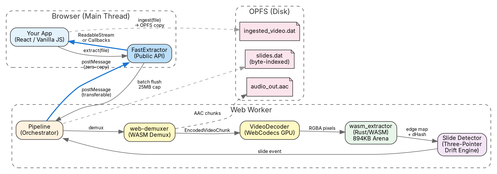
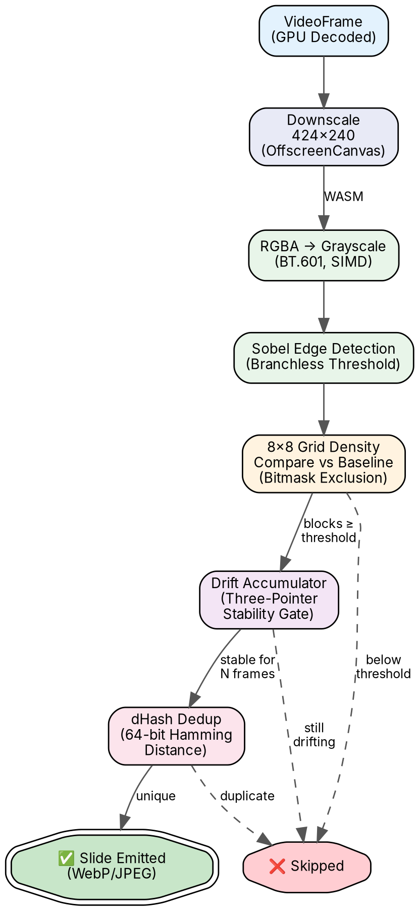

# ⚡ FastExtractor

**Browser-native video slide & audio extraction engine.**

Extract presentation slides and audio from video files entirely in the browser — no server, no uploads, no FFmpeg CLI. Powered by WebCodecs, WebAssembly, and OPFS.

> **[Live Demo →](https://fast-extractor.mm541.in)**

---

## Features

- **🖼️ Slide extraction** — unique slides captured as WebP/JPEG with millisecond-accurate timestamps
- **🎧 Audio extraction** — raw AAC/MP3/Opus stream passthrough, zero re-encoding
- **🚀 Turbo mode** — keyframe-only scanning, processes a 1-hour HD video in under 15 seconds
- **🎯 Sequential mode** — full-frame decode for pixel-perfect transition detection
- **🎭 Region masking** — 64-bit bitmask to exclude webcam overlays, watermarks, etc.
- **📊 Live metrics** — real-time decode speed, frame count, peak RAM, and analysis time
- **🔒 100% client-side** — your video never leaves the browser
- **📱 Mobile-safe** — adaptive memory management, Android SAF recovery, backpressure controls

---

## Benchmarks

*Full extraction pipeline: concurrent audio demuxing + unique slide detection + WebP/JPEG export.*

| Device | Resolution | Mode | Video Length | Time | Speed |
|--------|-----------|------|-------------|------|-------|
| **i9-12900H / 16GB / RTX 3050 Ti** (Linux Chrome) | 720p | Turbo | 3h 43m | **35s** | **382×** |
| **i9-12900H / 16GB / RTX 3050 Ti** (Linux Chrome) | 1080p | Turbo | 5h 53m | **1m 20s** | **265×** |
| **i9-12900H / 16GB / RTX 3050 Ti** (Linux Chrome) | 1080p | Sequential | 5h 53m | **22m** | **16×** |
| **Redmi Note 9 Pro** (SD 720G, 4GB, Android Chrome) | 1080p | Turbo | 5h 53m | **7m 30s** | **47×** |
| **AMD A6-7310** (2015 APU, 4GB, Linux Firefox) | 1080p | Turbo | 5h 53m | **10m 50s** | **32×** |

---

## Architecture



**Key design decisions:**

- **Zero GC pressure** — 894KB preallocated static WASM memory arena, no per-frame allocations
- **Hardware decode** — WebCodecs delegates to GPU, not software decoders
- **Zero-copy transfers** — `ArrayBuffer` transferred (not cloned) between Worker and main thread
- **LLVM-optimized** — bounds-check-free loops, branchless edge detection, SIMD auto-vectorization

### Per-Frame Detection Pipeline



---

## Quick Start

### Stream API

```typescript
import { FastExtractor } from './engine';

// 1. Check browser support
const support = await FastExtractor.checkBrowserSupport();
if (!support.supported) throw new Error(support.reason);

// 2. Create extractor
const extractor = new FastExtractor({ mode: 'turbo' });

// 3. Extract
const stream = extractor.extract(file);
const reader = stream.getReader();

while (true) {
  const { done, value: event } = await reader.read();
  if (done) break;

  switch (event.type) {
    case 'audio':
      // Raw codec chunk (ArrayBuffer) — stream to OPFS or accumulate
      await opfsWriter.write(event.chunk);
      break;

    case 'audio_done':
      // event.fileName = suggested filename
      // event.manifest = per-second byte-offset index (if buildManifest: true)
      break;

    case 'slide':
      // event.imageBuffer = WebP/JPEG ArrayBuffer
      // event.timestamp   = "01:23:45"
      // event.startMs     = 83000
      break;

    case 'progress':
      // event.percent = 0-100
      // event.message = status text
      // event.metrics = { totalFrames, totalSlides, peakRamMb, ... }
      break;
  }
}
```

### Callback API

```typescript
const extractor = new FastExtractor({ mode: 'turbo' });

await extractor.extractWithCallbacks(file, {
  onSlide: (slide) => {
    const blob = new Blob([slide.imageBuffer], { type: 'image/webp' });
    document.body.appendChild(Object.assign(document.createElement('img'), {
      src: URL.createObjectURL(blob)
    }));
  },
  onAudio: (chunk) => audioChunks.push(chunk),
  onProgress: (pct, msg) => console.log(`${pct}%: ${msg}`),
  onDone: () => console.log('Complete'),
});
```

### React Hook

```tsx
import { useFastExtractor } from './ui/useFastExtractor';

function App() {
  const {
    extract, cancel,
    isExtracting, progress, slides, audioBlob, error
  } = useFastExtractor({ mode: 'turbo' });

  return (
    <div>
      <input type="file" accept="video/*"
        onChange={(e) => extract(e.target.files![0])}
        disabled={isExtracting}
      />
      {isExtracting && <p>{progress.message} — {progress.percent}%</p>}
      {slides.map((s, i) => )}
      {audioBlob && <audio controls src={URL.createObjectURL(audioBlob)} />}
    </div>
  );
}
```

### Cancellation

```typescript
const controller = new AbortController();
const stream = extractor.extract(file, controller.signal);

// Cancel anytime:
controller.abort();
```

---

## Configuration

All options have sensible defaults. Most users won't need to change anything.

> **Tuning Tip:** Use the **[live demo](https://fast-extractor.mm541.in)** as a calibration workbench — drop in a sample video, adjust sliders, see which slides get captured in real-time, then copy the values into your code.

```typescript
new FastExtractor({
  mode: 'turbo',            // 'turbo' | 'sequential'
  extractAudio: true,
  extractSlides: true,
  buildManifest: false,      // Per-second byte-offset index for S3 range queries

  // Detection tuning
  sampleFps: 1,              // Sequential only: frames per second to analyze
  edgeThreshold: 30,         // Sobel sensitivity (10-100)
  blockThreshold: 12,        // Changed 8×8 blocks to trigger (1-64)
  minSlideDuration: 3,       // Seconds between captures
  densityThresholdPct: 5,    // Min edge % change per block (1-50)
  dhashDuplicateThreshold: 10, // Perceptual hash hamming distance (0-20)
  useDeferredEmit: true,     // Wait for transitions to settle before emitting

  // Output
  imageQuality: 0.8,         // WebP/JPEG quality (0.01-1.0)
  imageFormat: 'jpeg',       // 'webp' | 'jpeg'
  exportResolution: 0,       // Max width in px (0 = native)
  ignoreMask: 0n,            // 64-bit bitmask for 8×8 grid exclusion

  // Advanced drift detection
  cumulativeDriftMultiplier: 2,
  cumulativeSettledFrames: 2,
  partialThresholdRatio: 0.5,
  noiseResetFrames: 30,
  noiseMainRatio: 0.25,

  // Debugging
  debug: false,              // Log all worker messages to console
});
```

### Extraction Modes

| Mode | Strategy | Speed | Accuracy |
|------|----------|-------|----------|
| `'turbo'` | Keyframe-only seeking | ~20s / 1hr video | ~95% of transitions |
| `'sequential'` | Full frame decode | ~2-3min / 1hr video | 100% of transitions |

---

## Stream Events

| Event | Key Fields | Description |
|-------|-----------|-------------|
| `audio` | `chunk: ArrayBuffer` | Raw audio data (codec-specific framing) |
| `audio_done` | `fileName`, `manifest?` | Audio complete, optional byte-offset manifest |
| `slide` | `imageBuffer`, `timestamp`, `startMs` | New unique slide detected |
| `progress` | `percent`, `message`, `metrics?` | Extraction progress update |

---

## Error Codes

All fatal errors are `ExtractorError` instances with a typed `code`:

| Code | Meaning |
|------|---------|
| `ERR_OPFS_NOT_SUPPORTED` | Browser lacks OPFS |
| `ERR_OPFS_PERMISSION` | Storage permission denied |
| `ERR_OPFS_STALE_LOCK` | Previous crashed tab holds lock |
| `ERR_WASM_INIT` | WASM module failed to load |
| `ERR_FILE_INGEST` | File copy failed (**recoverable** — re-pick file) |
| `ERR_AUDIO_EXTRACTION` | No compatible audio track found |
| `ERR_VIDEO_DECODE` | WebCodecs / demuxer failure |
| `ERR_WORKER_GENERIC` | Unhandled worker exception |

```typescript
import { ExtractorError } from './engine';

try {
  // ... extract
} catch (err) {
  if (err instanceof ExtractorError) {
    console.error(err.code, err.message);
  }
}
```

---

## Static Methods

```typescript
// Check browser compatibility
const support = await FastExtractor.checkBrowserSupport();
// → { webCodecs, opfs, offscreenCanvas, deviceMemoryGb, isMobile, supported, reason? }

// Clean up OPFS temp files
await FastExtractor.cleanupStorage();
```

---

## Browser Compatibility

| Browser | Status | Notes |
|---------|--------|-------|
| Chrome 102+ (Desktop & Android) | ✅ Full support | Recommended |
| Edge 102+ | ✅ Full support | Chromium-based |
| Firefox 130+ | ✅ Full support | WebCodecs enabled by default |
| Brave / Vivaldi | ✅ Full support | Chromium-based |
| Safari (macOS/iOS) | ❌ Unsupported | No OPFS SyncAccessHandle |

**Required:** Secure Context (HTTPS), WebCodecs, OPFS with `SyncAccessHandle`

**Formats:** `.mp4`, `.mov`, `.webm`, `.mkv` — H.264, H.265*, VP8, VP9, AV1

---

## Project Structure

```
fast-extractor/
├── src/
│   ├── engine/                  # Core extraction library (framework-agnostic)
│   │   ├── FastExtractor.ts     #   Public API — Stream + Callback + Error system
│   │   ├── extractor.ts         #   Slide detection (three-pointer drift engine)
│   │   ├── pipeline.ts          #   Decode orchestration + backpressure
│   │   ├── worker.ts            #   Web Worker — OPFS + audio + video pipeline
│   │   ├── errors.ts            #   Typed ExtractorError codes
│   │   ├── types.ts             #   All public type definitions
│   │   ├── index.ts             #   Barrel export
│   │   └── wasm/                #   Pre-built WASM binaries
│   └── ui/                      # Reference demo app (React)
│       ├── App.tsx              #   Orchestration + OPFS streaming
│       ├── GridMaskPicker.tsx   #   Interactive region masking
│       ├── useFastExtractor.ts  #   React hook wrapper
│       └── components/          #   Extracted UI components
└── wasm-extractor/
    └── src/lib.rs               # Rust/WASM module
        • 894KB static memory arena (zero GC)
        • RGBA→grayscale (BT.601, SIMD)
        • Branchless Sobel edge detection
        • 64-bit dHash perceptual hashing
        • 8×8 grid density comparison
        • Audio extraction (Symphonia AAC/MP3/Opus/Vorbis)
```

---

## Safety Invariants

| Invariant | Enforced By |
|---|---|
| Zero per-frame allocations | `FrameArena` (894KB preallocated `UnsafeCell`) |
| No data races | `UnsafeCell` interior mutability (prevents LLVM `noalias` UB) |
| VideoFrame leak prevention | Every `VideoFrame` closed immediately after pixel copy |
| OPFS lock timeout | `createSyncAccessHandleWithTimeout(5000ms)` |
| Mobile file expiry bypass | File copied to OPFS while `<input>` permission is alive |
| Zero-copy slide transfer | `ArrayBuffer` transferred via `postMessage` transferList |

---

## Development

```bash
npm install        # Install dependencies
npm run dev        # Dev server with HMR
npm run build      # Production build
```

### Rebuilding WASM

```bash
npm run build:wasm
# Or: cd wasm-extractor && wasm-pack build --target web --out-dir ../src/engine/wasm
```

---

## Use Cases

- **Lecture → study notes** — Extract slides + audio, feed to Whisper for transcription
- **RAG pipelines** — Slide images + timestamps → multi-modal vector embeddings
- **Accessibility** — Generate slide descriptions from video content
- **Archival** — Pull presentation assets from screen recordings

---

## License

Released under the [MIT License](LICENSE).

---

Built by [Mohd Moazzam](https://github.com/mm541)
