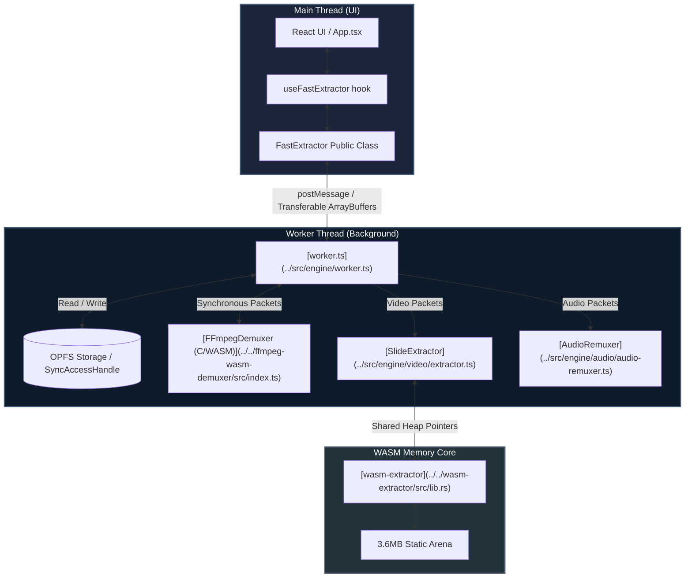

# FastExtractor System Architecture

FastExtractor is a high-performance, 100% browser-native slide extraction and audio demuxing library. This document outlines the system architecture, threading model, and component interactions that enable processing long-form HD presentations in seconds entirely client-side.

---

## 🏛 System Overview

The system is structured as three distinct execution layers separated by boundary interfaces:



---

## 🧵 Threading & Messaging Model

To keep the user interface responsive at 60 FPS, all computationally heavy workloads (demuxing, decoding, image processing, and hashing) are executed inside a dedicated Web Worker ([worker.ts](../src/engine/worker.ts)).

### 1. Ingestion Boundary
- The Main Thread reads the source `File`/`Blob` and transfers it to the Worker.
- In modern browsers supporting the **Origin Private File System (OPFS)**, the file is written to OPFS.
- In the worker, the filesystem is queried synchronously using a `FileSystemSyncAccessHandle` for maximum SSD read throughput.

### 2. Message Exchange (Zero-Copy Transfers)
To eliminate garbage collection pauses and serialization overhead, data transferred between the Main Thread and Worker uses **Transferable Objects**:
- **Video slides**: Emitted as raw `ArrayBuffer` blocks containing WebP or JPEG binary data.
- **Audio chunks**: Emitted incrementally as `ArrayBuffer` packets of lossless AAC or MP3/Opus data.
- Structured cloning is avoided for large buffers; the ownership of the memory block is transferred, rendering the worker's reference instantly null.

---

## 📦 Component Map

The repository is organized as a monorepo-style structure under `fast-extractor/`:

```
fast-extractor/
├── src/
│   ├── engine/                  # Public library wrapper (framework-agnostic)
│   │   ├── [FastExtractor.ts](../src/engine/FastExtractor.ts)     #   Entry point, ReadableStream wrapper
│   │   ├── [pipeline.ts](../src/engine/pipeline.ts)          #   Orchestrator of worker lifecycle
│   │   ├── [worker.ts](../src/engine/worker.ts)            #   Background worker thread entry
│   │   ├── audio/               #   Lossless audio remuxer (ADTS framing)
│   │   └── video/               #   Slide detection engine & canvas renderer
│   └── ui/                      # Reference React hook and workbench UI
├── wasm-extractor/              # Slide Detection Rust crate (compiles to WASM)
└── ffmpeg-wasm-demuxer/         # C FFmpeg 8.1 wrapper (compiles to WASM)
```

---

## 💾 Storage Architecture (OPFS)

The **Origin Private File System (OPFS)** serves as the local scratchpad. Standard Web APIs (like `FileReader` or `.arrayBuffer()`) require loading the entire file into JavaScript VM memory, which instantly crashes mobile browsers with ≤4GB RAM on long videos (e.g. 1GB+ files).

FastExtractor bypasses this by streaming the video file directly into OPFS:
1. **Low-Memory Ingestion**: The input stream is chunked into 64KB blocks and appended to an OPFS temp file.
2. **Synchronous Seeking**: The C-level FFmpeg demuxer reads from this file using the synchronous `FileSystemSyncAccessHandle`. This permits sub-millisecond seek times that match local filesystem performance.
3. **Lock Safety**: Multiple tabs might attempt to write to the same OPFS temp file name. The system handles this by using a unique file namespace and testing locks with a 5000ms timeout before gracefully degrading.

---

## 📚 Further Reading

To explore specific modules in detail:
- **[Video & Audio Extraction Pipelines](PIPELINE_AND_DETECTION.md)**: Details the ADTS audio remuxer, WebCodecs configuration, backpressure tuning, and the Three-Pointer Drift stability gate.
- **[Rust WASM Memory Arena & SIMD Optimizations](WASM_MEMORY_AND_SIMD.md)**: Details the flat `FrameArena` memory layout, bounds-check elimination, branchless Sobel execution, and single-threaded interior safety.
