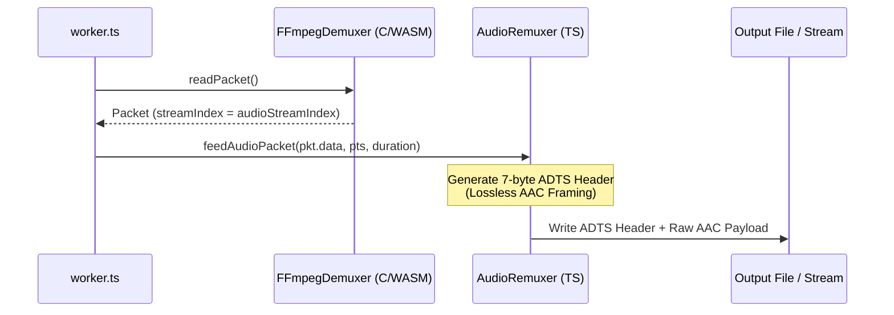
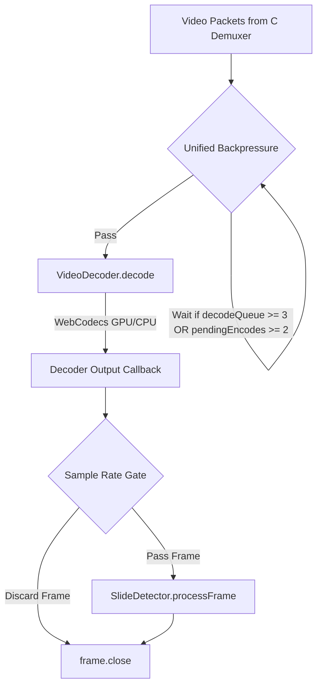
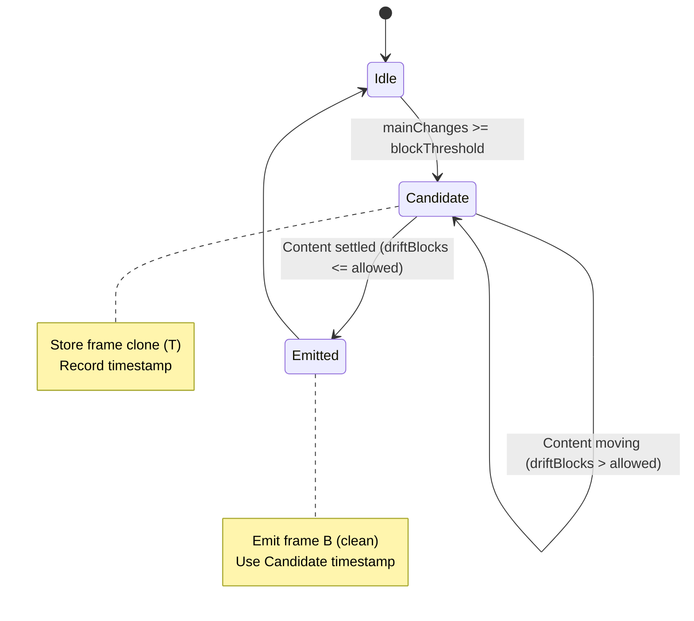

# Video & Audio Extraction Pipelines

This document details the video decoding, audio remuxing, backpressure control, and slide detection algorithms utilized in the FastExtractor library.

---

## 🎧 Lossless Audio Demuxing ([AudioRemuxer](../src/engine/audio/audio-remuxer.ts))

Instead of transcoding the video's audio track (which is extremely CPU-heavy and memory-intensive), FastExtractor extracts raw audio packets and remuxes them losslessly.

### The ADTS framing protocol:
Raw AAC audio packets extracted from MP4 containers lack sync headers, meaning they cannot be played as a standalone `.aac` file. [audio-remuxer.ts](../src/engine/audio/audio-remuxer.ts) prefixes each packet with a 7-byte **ADTS (Audio Data Transport Stream)** header:
- **Syncword**: `0xFFF` (12 bits) to identify the start of the audio frame.
- **MPEG Version**: `0` for MPEG-4, `1` for MPEG-2.
- **Profile**: AAC-LC (Low Complexity = 1).
- **Sampling Frequency Index**: e.g., `4` for 44.1kHz.
- **Channel Configuration**: e.g., `2` for stereo.
- **Frame Length**: Encodes the combined size of the header + raw AAC payload.

This operation has **zero-allocation overhead** and executes in microseconds, achieving lossless audio extraction.

---

## 📽 Video Pipeline & WebCodecs Orchestration

The video extraction pipeline processes encoded video chunks using the browser's hardware-accelerated **WebCodecs API** (`VideoDecoder`).

### 1. Unified Backpressure & Deadlock Prevention
To prevent uncompressed `VideoFrame` and `ImageBitmap` objects from overwhelming the system memory (OOM spikes), [extractor.ts](../src/engine/video/extractor.ts) throttles the ingestion at the entrance of `feedChunk`:
- **Thresholds**: Pauses packet feeding if `decodeQueueSize >= 3` (decoder backed up) OR `pendingEncodes >= 2` (encoder backing up).
- **Non-blocking Wait**: Uses an async loop that awaits the `ondequeue` callback of the `VideoDecoder`.
- **Latency Target**: Configured with `optimizeForLatency: true` to force the browser's underlying decoder to flush output immediately, avoiding internal packet buffering.

### 2. Software Fallback Routing
In **Turbo Mode** (keyframe seeking), the system configures the decoder with `hardwareAcceleration: 'prefer-software'`.
* **The GPU Hazard**: Some mobile and integrated GPU drivers silently drop or return empty frames when instructed to seek rapidly across far-apart keyframes.
* **The CPU Solution**: Forcing software decoding (VP9/H.264 CPU decoders) guarantees 100% frame delivery and avoids rendering black frames on canvas.

---

## 🧠 Slide Detection Algorithm: Three-Pointer Drift

The core slide detection logic runs inside [SlideDetector.ts](../src/engine/video/SlideDetector.ts) and uses a **Three-Pointer** frame buffer comparison system in WASM.

### 1. The Three Pointers
The WASM memory arena maintains three concurrent frame states:
1. **Buffer A (Baseline)**: The frame corresponding to the last emitted slide.
2. **Buffer Prev (T - 1)**: The frame immediately preceding the current one.
3. **Buffer B (Current / T)**: The frame currently being evaluated.

On every frame, the engine calculates two metrics:
* $\text{mainChanges} = \text{compare\_frames}(A, B)$ (Difference from baseline)
* $\text{driftBlocks} = \text{compare\_prev\_current}(Prev, B)$ (Frame-to-frame movement)

---

### 2. The Stability Gate (Deferred Emit)

To prevent capturing blurry, mid-animation, or cross-fading frames during slide transitions, FastExtractor uses a **Stability Gate**:

1. **Trigger**: When a major visual difference is detected ($\text{mainChanges} \ge \text{blockThreshold}$), the frame is not emitted. Instead, it is cloned and stored as a **Candidate**.
2. **Evaluation**: On subsequent frames, we track $\text{driftBlocks}$ (frame-to-frame speed).
3. **Emission**: Once $\text{driftBlocks}$ drops below a settled threshold (i.e. the slide has stopped changing/fading), the **current frame** is captured (delivering a clean image) but timestamped with the **candidate's original trigger time**.
4. **Timeout**: If the scene continues to move without settling for 15 seconds (e.g. video handwriting), the gate times out and forces emission of the slide anyway.

---

## 📚 Further Reading

To explore specific modules in detail:
- **[System Architecture](ARCHITECTURE.md)**: Details the three-tier system layers, threading model, message passing, and OPFS storage architecture.
- **[Rust WASM Memory Arena & SIMD Optimizations](WASM_MEMORY_AND_SIMD.md)**: Details the flat `FrameArena` memory layout, bounds-check elimination, branchless Sobel execution, and single-threaded interior safety.
