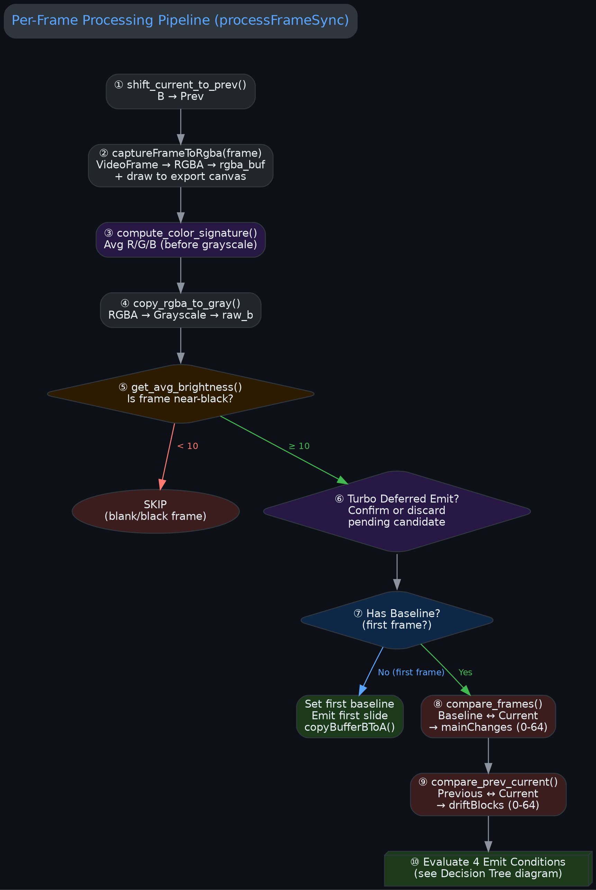
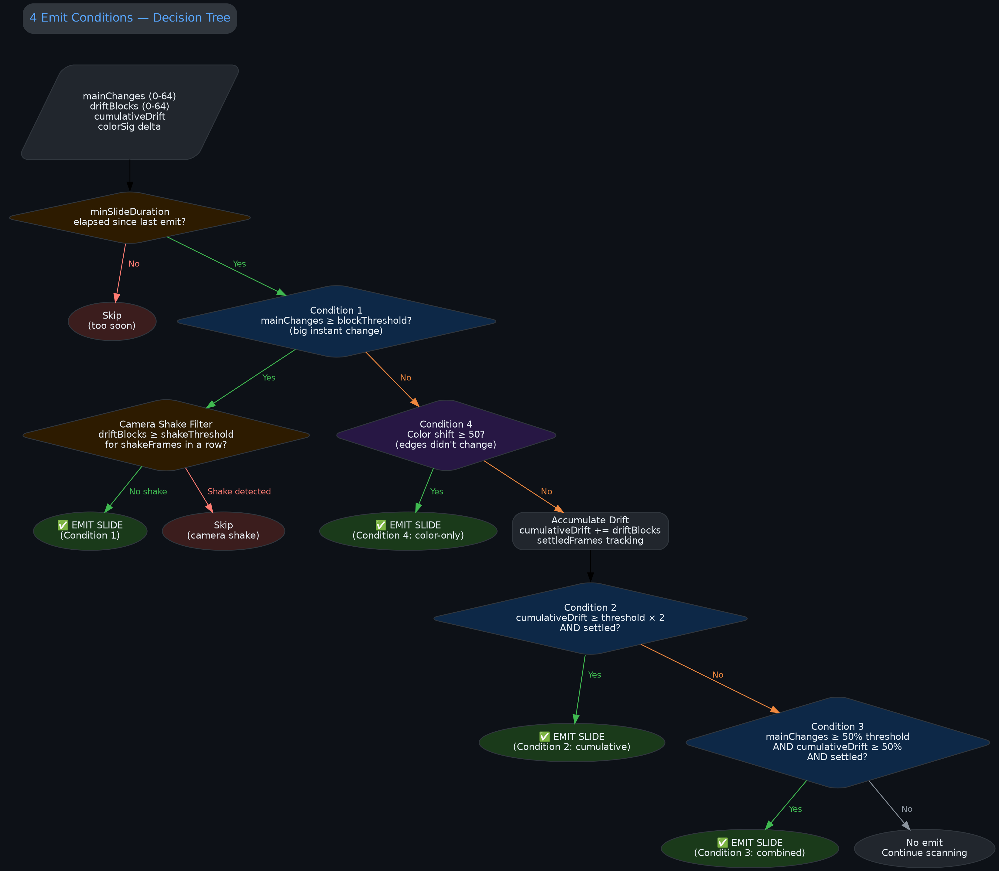
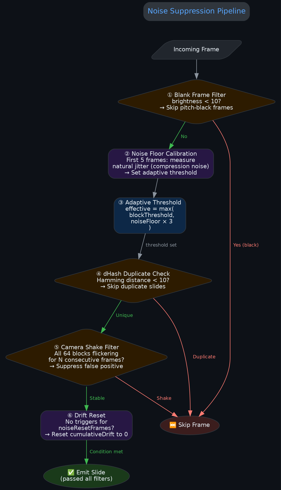
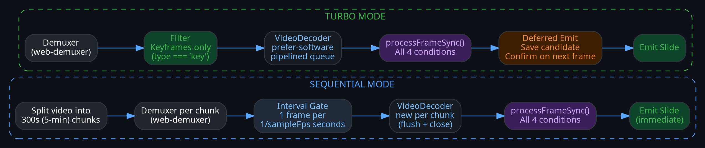

# Slide Detection — Orchestrator (Decision Logic)

> **Module:** `src/engine/extractor.ts`  
> **Last Audited:** 2026-04-24 (in progress)  
> **Scope:** TypeScript decision engine — how raw WASM numbers become slide-emit decisions.

## Documentation Map

| Document | Covers |
|----------|--------|
| [slide-detection-wasm.md](./slide-detection-wasm.md) | WASM math: edge detection, grid density, dHash, color signature |
| [slide-detection-orchestrator.md](./slide-detection-orchestrator.md) | TypeScript decision logic: 4 emit conditions, noise calibration, drift tracking |
| [audio-extraction-wasm.md](./audio-extraction-wasm.md) | WASM audio: Symphonia AAC demuxing, ADTS header wrapping |

---

## Per-Frame Processing Pipeline

Every video frame passes through this 10-step pipeline inside `processFrameSync()`.



| Step | Function | What happens |
|------|----------|-------------|
| ① | `shift_current_to_prev()` | Copy current frame (B) to previous buffer (Prev) |
| ② | `captureFrameToRgba(frame)` | Draw VideoFrame to canvas, copy RGBA pixels to WASM |
| ③ | `compute_color_signature()` | Calculate avg R/G/B before grayscale conversion |
| ④ | `copy_rgba_to_gray()` | Convert RGBA → grayscale using BT.601 luma |
| ⑤ | `get_avg_brightness()` | Skip pitch-black frames (< 10 brightness) |
| ⑥ | Turbo deferred emit | Confirm or discard pending candidate from previous frame |
| ⑦ | Baseline check | If first frame → set baseline, emit, return |
| ⑧ | `compare_frames()` | Baseline ↔ Current → mainChanges (0-64 blocks) |
| ⑨ | `compare_prev_current()` | Previous ↔ Current → driftBlocks (0-64 blocks) |
| ⑩ | Evaluate conditions | Run 4 emit conditions (see below) |

---

## The 4 Emit Conditions

All conditions require `minSlideDuration` (default: 0.3s) to have elapsed since the last emit.



### Condition 1: Direct Threshold
```
mainChanges ≥ blockThreshold
```
A big, obvious, instant slide change. Most transitions are caught here.

**Guard:** Camera shake filter — if ALL 64 blocks are changing simultaneously for N consecutive frames, it's likely the camera shaking (recorded lecture), not a real slide change. Suppressed.

### Condition 2: Cumulative Drift
```
cumulativeDrift ≥ blockThreshold × driftMultiplier  AND  screen has settled
```
Many small per-frame changes that individually are below threshold, but collectively indicate a real transition (e.g., slow scrolling, fade-in animations). Only triggers when the screen has stopped moving (settled = driftBlocks == 0 for settleFrames).

### Condition 3: Combined Weak Signals
```
mainChanges ≥ 50% of blockThreshold  AND  cumulativeDrift ≥ 50% of threshold  AND  settled
```
Neither the main comparison nor the drift alone would trigger, but together they indicate a real change. Catches subtle transitions that neither Condition 1 nor Condition 2 would detect individually.

### Condition 4: Color-Only Change
```
max(|ΔR|, |ΔG|, |ΔB|) ≥ colorChangeThreshold (default: 50)
```
Edge detection says nothing changed (same text, same layout), but the average screen color shifted significantly. Catches dark mode toggles, background color swaps, and syntax highlighting changes.

---

## Noise Suppression Pipeline

Multiple layers of filtering prevent false positive slide emissions.



| Filter | What it catches | Threshold |
|--------|----------------|-----------|
| Blank frame | Fade-to-black transitions, intro/outro black screens | brightness < 10 |
| Noise floor calibration | H.264 compression jitter in static video | Adaptive: noiseFloor × 3 |
| dHash duplicate check | Same slide re-emitted after a brief animation | Hamming distance ≤ 10 |
| Camera shake filter | Recorded lecture with shaky camera | All 64 blocks changing for N frames |
| Drift reset | Random noise accumulating into false cumulative triggers | Reset after noiseResetFrames idle |

---

## Extraction Modes



### Turbo Mode
- Decodes **only keyframes** (IDR frames) from the video.
- Uses a single pipelined `VideoDecoder` with `prefer-software`.
- **Debounce:** Enforces `minSlideDuration`. If two slides happen within 3 seconds, the second is ignored.
- Speed: ~10-20s for a 1-hour video.

### Sequential Mode
- Decodes **every frame** in 300s (5-minute) chunks.
- Creates a new `VideoDecoder` per chunk (flush + close) to bound memory.
- Interval gating: only processes 1 frame per `1/sampleFps` seconds (default: 1 FPS).
- Emits immediately (no deferred confirmation needed since it sees every frame).
- Speed: ~120-150s for a 1-hour video.

---

## State Variables

| Variable | Type | Purpose |
|----------|------|---------|
| `hasBaseline` | boolean | Whether the first frame has been processed |
| `lastSlideTime` | number | Timestamp of last emitted slide (for minSlideDuration) |
| `cumulativeDrift` | number | Running total of small per-frame driftBlocks |
| `settledFrames` | number | Consecutive frames with driftBlocks == 0 |
| `noiseFloor` | number | Measured compression noise level (first 5 frames) |
| `isCalibrated` | boolean | Whether noise calibration is complete |
| `savedHashes` | bigint[] | dHash values of all emitted slides (duplicate detection) |
| `prevColorSig` | [R, G, B] | Color signature of the previous frame |
| `pendingCandidate` | object \| null | Turbo deferred-emit: saved bitmap + hash awaiting confirmation |

---

## Future Architecture: Pluggable Strategy Engines

Currently, the 4 emit conditions are hardcoded into `extractor.ts`. To support a "Zero-Config" fully adaptive extractor in the future, the architecture will be decoupled:

1. **`SlideExtractor` (The Orchestrator)**: Handles `VideoDecoder`, canvas, WASM buffers, and chunking.
2. **`DetectionEngine` (The Strategy)**: An interface that takes raw WASM numbers and returns an emit decision.

### Planned Engine Types:
- **`ThresholdEngine`**: (Current) Uses blockThreshold and drift to detect slides. Best for static presentations.
- **`StabilityEngine`**: (Future) Ignored blockThreshold entirely. Emits only when `driftBlocks == 0` for N frames. Best for sequential mode and live-coding tutorials.
- **`ZeroConfigEngine`**: (Future) Two-pass statistical engine or lightweight ML model that requires no manual parameter tuning.

This split ensures the complex video plumbing doesn't need to change when we add smarter detection logic.

---

## Next Steps

This document will be expanded as we audit `extractor.ts` line by line. Sections to be added:
- [x] Detailed ExtractionOptions reference with all defaults
- [ ] Debug mode output specification
- [ ] Error handling and error codes
- [ ] Extensibility guide for adding new emit conditions
