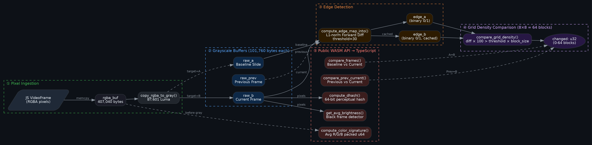
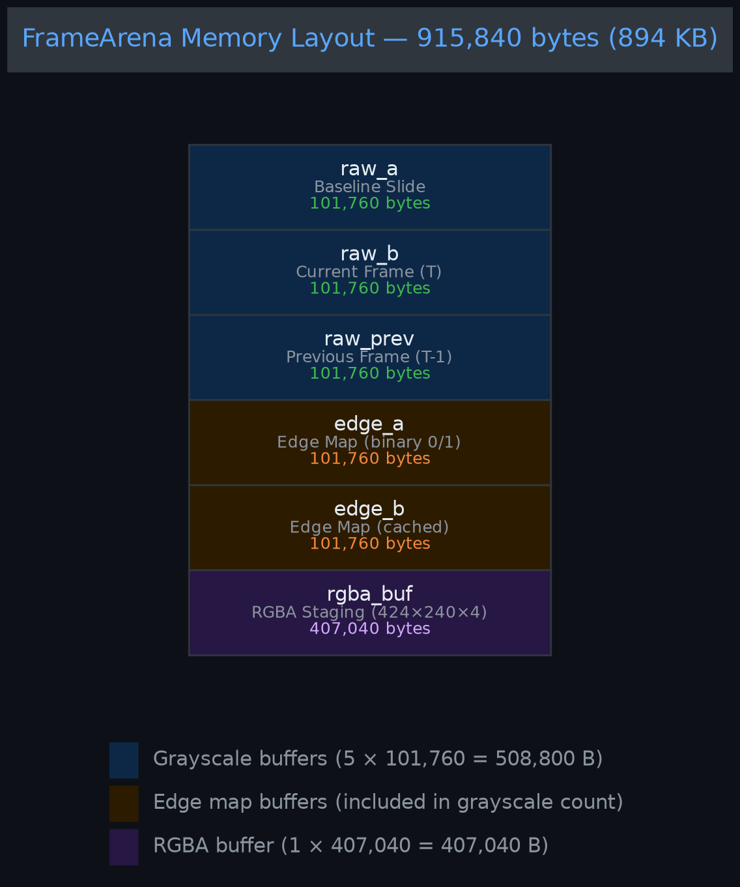
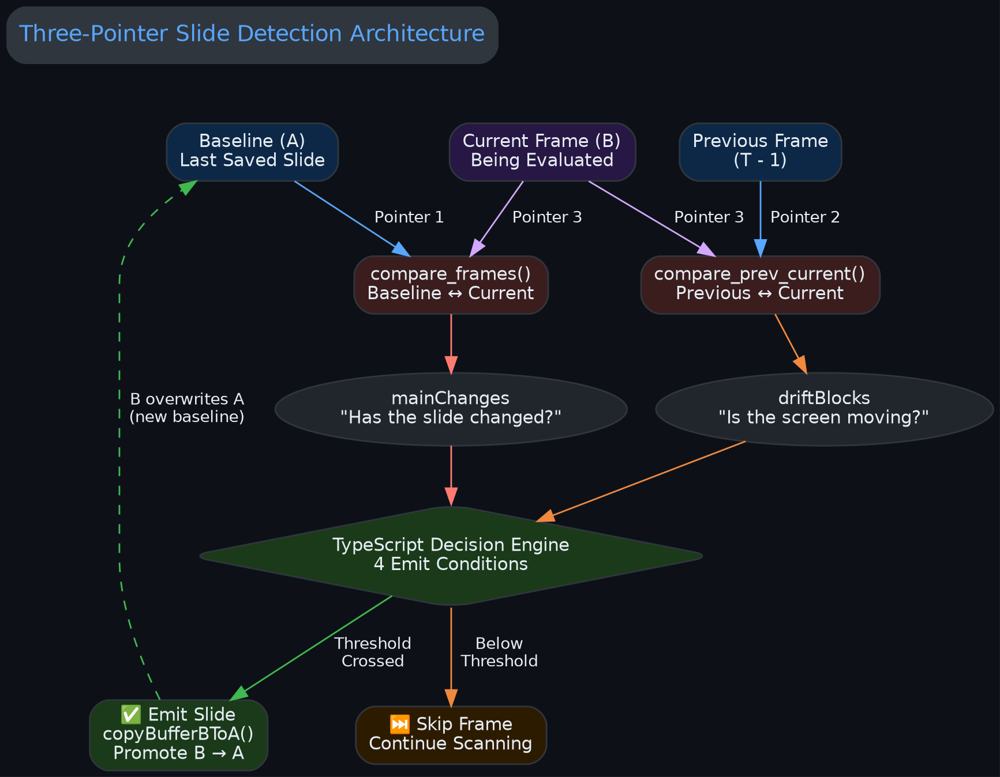
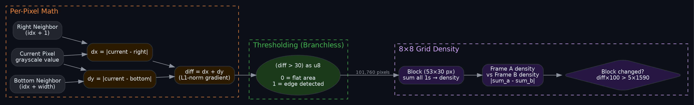

# Slide Detection — WASM Computation Layer

> **Module:** `wasm-extractor/src/lib.rs` (Lines 1-361)  
> **Last Audited:** 2026-04-24  
> **Scope:** Slide detection math only. Audio extraction (`AudioExtractor`, Lines 365+) is documented separately in [audio-extraction-wasm.md](./audio-extraction-wasm.md).

## Documentation Map

| Document | Covers |
|----------|--------|
| **→ You are here** | WASM math: edge detection, grid density, dHash, color signature |
| [slide-detection-orchestrator.md](./slide-detection-orchestrator.md) | TypeScript decision logic: 4 emit conditions, noise calibration, drift tracking |
| [audio-extraction-wasm.md](./audio-extraction-wasm.md) | WASM audio: Symphonia AAC demuxing, ADTS header wrapping |

The WASM layer computes raw numbers (changed blocks, hashes, brightness). The TypeScript layer (`extractor.ts`) consumes these numbers and decides when to actually emit a slide. Read both documents together for the full picture.

---

## Architecture Overview

The slide detection engine runs entirely inside WebAssembly, called from a Web Worker. It uses a static memory arena to achieve zero per-frame allocations and zero GC pressure.



---

## Memory Layout

Six fixed buffers are allocated once on first use via `init_arena()`. Never freed, never resized.

**Total: 915,840 bytes (~894KB).**



| Buffer | Type | Size (bytes) | Purpose |
|--------|------|-------------|---------|
| `raw_a` | Grayscale (u8) | 101,760 | Baseline — the last saved slide |
| `raw_b` | Grayscale (u8) | 101,760 | Current video frame being evaluated |
| `raw_prev` | Grayscale (u8) | 101,760 | Previous video frame (drift detection) |
| `edge_a` | Binary (0 or 1) | 101,760 | Edge map of baseline (or scratch for prev) |
| `edge_b` | Binary (0 or 1) | 101,760 | Edge map of current frame (cached via `edge_b_valid`) |
| `rgba_buf` | RGBA (u8×4) | 407,040 | Staging area for pixel ingestion from JavaScript |

### Safety: WasmCell + UnsafeCell

The arena uses `UnsafeCell` wrapped in a `WasmCell` struct with a manual `unsafe impl Sync`.

**Safety invariants:**
1. WASM is single-threaded — no data races possible.
2. No re-entrancy — JS never calls Rust concurrently.
3. `arena()` is called at most once per exported function scope.

---

## Three-Pointer Slide Detection

The engine uses three memory pointers to detect slide changes while filtering out noise and animations.



| Comparison | Function | Buffers | Question |
|-----------|----------|---------|----------|
| Main | `compare_frames()` | Baseline (A) ↔ Current (B) | "Has the slide changed from the one we saved?" |
| Drift | `compare_prev_current()` | Previous ↔ Current (B) | "Is the screen currently moving?" |
| Promote | `copyBufferBToA()` (JS) | Copies B → A | "Set current frame as the new baseline" |

### Why both comparisons are needed

- **Baseline vs Current** catches slow fade transitions that accumulate over many frames.
- **Previous vs Current** acts as a settle detector — it tells the engine to wait until animations finish before capturing a clean screenshot.

---

## Edge Detection Algorithm

Uses L1-norm First-Order Forward Difference gradient with branchless thresholding.



### Per-pixel math:
```
dx = |current_pixel - right_pixel|
dy = |current_pixel - bottom_pixel|
diff = dx + dy
edge = (diff > 30) as u8    // branchless: outputs 0 or 1
```

### Default threshold: `30`
- **Too low (5-10):** Detects H.264 compression noise, gradient banding, and soft shadows as edges. Causes false positives.
- **Too high (150+):** Only detects extreme contrast (black text on white). Misses gray text, pastel colors, and anti-aliased font edges.
- **30:** Filters all compression noise while catching all text and shape edges.

---

## Grid Density Comparison

Divides the 424×240 frame into an **8×8 grid** of 64 macro-blocks (53×30 pixels each).

### Algorithm:
1. For each block, sum all edge values in Frame A → `sum_a`.
2. Sum all edge values in Frame B → `sum_b`.
3. Calculate `diff = |sum_a - sum_b|`.
4. If `diff × 100 > threshold_pct × block_size` → block changed.

### Why density comparison (NOT pixel-by-pixel):
- **Immune to:** Sub-pixel shifts, anti-aliasing flicker, and video compression noise.
- **Trade-off:** Cannot detect shape changes where the total edge mass stays identical (e.g., "Cat" replaced by "Dog" with the same number of edge pixels). This is extremely rare in real presentations.

### Mask support:
A 64-bit bitmask where bit `(row×8 + col) = 1` means skip that block (e.g., ignore webcam overlay).

---

## Function Reference

### Pixel Ingestion
| Function | Purpose |
|----------|---------|
| `copy_rgba_to_gray(is_target_b)` | Converts RGBA staging buffer to grayscale using BT.601 luma: `(77R + 150G + 29B) >> 8` |

### Edge Detection
| Function | Purpose |
|----------|---------|
| `compute_edge_map_into(pixels, w, h, threshold, out)` | Computes binary edge map via Forward Difference gradient |

### Frame Comparison
| Function | Purpose | Returns |
|----------|---------|---------|
| `compare_frames(edge_threshold, density_num, mask)` | Baseline (A) vs Current (B) | Changed block count (0-64) |
| `compare_prev_current(edge_threshold, density_num, mask)` | Previous vs Current (B) | Changed block count (0-64) |

### Perceptual Hashing
| Function | Purpose | Returns |
|----------|---------|---------|
| `compute_dhash(is_buffer_b)` | 64-bit dHash perceptual fingerprint | `u64` hash |

**Algorithm (dHash):** Shrink image to 9×8 thumbnail → compare adjacent cells → left > right = 1, else 0 → 64 bits.  
**Published by:** Dr. Neal Krawetz (2013). Used by Google Images, Facebook, TinEye, Python `imagehash`.

### Frame Utilities
| Function | Purpose | Returns |
|----------|---------|---------|
| `get_avg_brightness()` | Average brightness of current frame | 0-255 (skip if < 10 = black frame) |
| `compute_color_signature()` | Average R/G/B of current frame | Bit-packed `u64`: `[R:16\|G:16\|B:16\|0:16]` |

---

## Performance Optimizations

| Technique | Where | Effect |
|-----------|-------|--------|
| Slice assertions (`&buf[..len]`) | All hot functions | LLVM drops all bounds checks |
| `iter().zip()` / `chunks_exact()` | Grid density, grayscale, brightness, color sig | SIMD auto-vectorization |
| Branchless `(bool) as u8` | Edge detection | Eliminates branch prediction stalls |
| Integer cross-multiplication | Grid density threshold | Avoids floating-point division |
| Mathematical `block_size` | Grid density, dHash | Removes 100K+ additions per frame |
| Edge map caching (`edge_b_valid`) | `compare_frames` / `compare_prev_current` | Cuts edge computation in half |
| Bit-packed return values | Color signature | Zero JS object allocation at WASM boundary |

---

## Turbo Mode: Software Decoding

Turbo mode explicitly uses `hardwareAcceleration: 'prefer-software'` for the `VideoDecoder`.

**Reason:** Hardware decoders output opaque GPU textures. When drawn to `OffscreenCanvas` in a Web Worker via `drawImage()`, these textures render as black frames. The brightness filter (`< 10`) then skips every frame, resulting in zero slide detection. Software decoding returns CPU-backed frames that `drawImage` + `getImageData` can read correctly.

---

## Next: TypeScript Decision Engine

This document covers the WASM computation layer — it produces raw numbers. The actual slide-emit decisions (when to save a screenshot, when to skip, how to handle noise and animations) are made by the TypeScript engine.

**→ Continue reading: [slide-detection-engine.md](./slide-detection-engine.md)**
